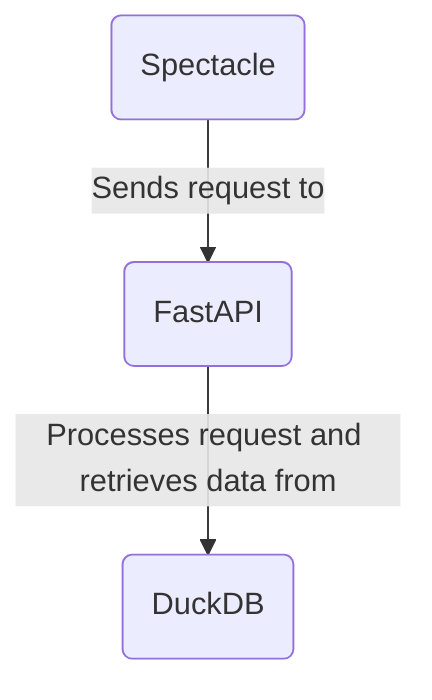

# ADK Wrapped

## Architecture

We're using a standard client-server architecture with a stationary pre-filled backend database.

- `sql_prep/`: A training component that restructures the data into a series of achievements / presentable statistics. **This is handled using dbt/SQL with a sprinkle of Python on top of a DuckDB database**, since our dataset is small (&lt;50MB).
- `backend/`: A transfer component that communicates the data to the presentation layer via API. **FastAPI handles this.**
- `frontend/`: A presentation component that displays the data in a meaningful/beautiful way. **React/Spectacle handles this.**



## Environment

1. Get a DuckDB export of the dataset and place it in `data/adk_wrapped.db`.
2. Create a `profiles.yml` file in `~/.dbt` with the following contents:
    ```yaml
    adk_wrapped:
        outputs:
            dev:
                path: "path/to/data/adk_wrapped.db"
                schema: adk_wrapped
                type: duckdb
                threads: 4
                extensions:
                    - httpfs
                    - parquet
        target: dev
    ```
2. For local development, run `make setup` to install the dependencies, including and especially `dbt-duckdb`. (This doesn't set up the frontend, though.)
    1. Run `make run` to let `dbt` populate the database with transformations.
    2. Run `make backend` to start the FastAPI server.
    3. In a separate terminal, run `make frontend` to start the React server.
3. For deployment/testing, `docker-compose up` should do everything. _(Currently, it's still missing the nginx component.)_

## Endpoints _(To settle)_

### React/Spectacle

- `/` displays everything for now.

### FastAPI

- `/achievements/{greybox_id}` to pass the achievements to the presentation layer.
- NOT DONE: `/gdpr` to handle initial consent and GDPR compliance (?).
- NOT DONE: `/authenticate` to ensure Greybox 2.0 is logged into.

