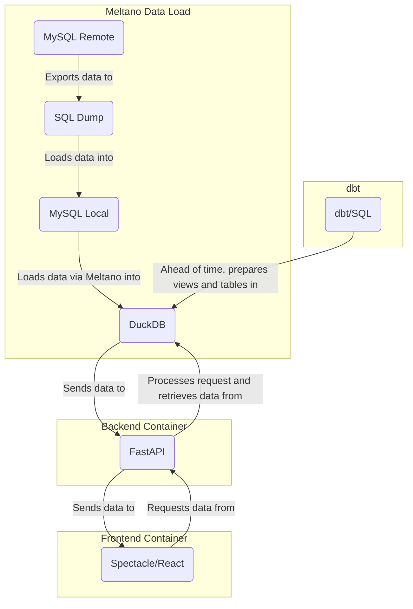

# greybox Wrapped

greybox Wrapped[^1] is a project that displays statistics and achievements from academic high-school debates in a "rewind" style popularized by Spotify Wrapped.

At the Czech Debating Association, we track all debates that take place at our events in a database called "greybox" [^2]. This project allows us to analyse the data and award individuals' achievements on the backend. On the frontend, individuals are be able to request personalised presentation of their achievements each year.

## Architecture

We're using a standard client-server architecture with a stationary pre-filled backend database.

- `greybox_conversion/`: A training component that restructures the data into a series of achievements / presentable statistics. **This is handled using dbt/SQL with a sprinkle of Python on top of a DuckDB database**, since our dataset is small (&lt;50MB).
- `backend/`: A transfer component that communicates the data to the presentation layer via API. **FastAPI handles this.**
- `frontend/`: A presentation component that displays the data in a meaningful/beautiful way. **React/Spectacle handles this.**



## Environment (data prep)

See [greybox_conversion/README.md](greybox_conversion/README.md) for the data preparation pipeline.
## Environment (dev)

1. Get a DuckDB export of the dataset and place it in `data/adk_wrapped_full.db`.
2. Optionally, get a copy of the rainbow tables and place them in `data/rainbow_tables.csv`. Ensure that the column names are `greybox_id` and `hash`.
3. For local development, run `make setup` to install the dependencies, including and especially `dbt-duckdb`. (This doesn't set up the frontend, though.)
    1. Run `make build` to let `dbt` populate the database with transformations.
    2. Run `make backend` to start the FastAPI server.
    3. In a separate terminal, run `make frontend` to start the React server. (To be able to do that, you'll need to set up [Node Version Manager for Windows - `nvm`](https://github.com/coreybutler/nvm-windows) first and, using it, Node v18.15.0.)
4. For deployment/testing, `docker-compose up` should do everything.

## Endpoints

All endpoints are managed by nginx, which is packaged in `frontend/Dockerfile`.

### Frontend (React/Spectacle)

- `/` displays a prompt to go back to Greybox 2.0 and follow the requisite link.
- `/slides/{person_id}` to display the achievements of a given person.
- `/link/{id_hash}` to display the achievements of a given person, with a lookup provided via a rainbow table entry.

### Backend (FastAPI)

- `/api` to display the API documentation.
- `/api/achievements/{greybox_id}` to pass the achievements to the presentation layer.
- `/api/link/{id_hash}` to pass the achievements to the presentation layer, with a lookup provided via a rainbow table entry.

## Deployment to fly.io

We're using [fly.io](https://fly.io) to deploy the backend and frontend, both using the `Dockerfile` and `fly.toml` in the respective directories. We're basically playing the role of `docker-compose.yml` by manually handling the volumes, networking, and environment variables.

### Setup

The `fly.toml` files are already set up now. The prerequisites were:

```bash
cd frontend
fly apps create adk-wrapped
cd ../backend
fly apps create adk-wrapped-api
fly volumes create adk_wrapped_data --region ams --size
```

The app is currently deployed to the Amsterdam (`ams`) region.

### Deployment

`make deploy` pushes both the frontend and backend to fly.io. However, to update the volume, we must ssh/SFTP into the backend nad `puts` it there manually.

```bash
cd backend
fly ssh console
# SSH prompt will appear
rm /data/adk_wrapped.db
exit
fly ssh sftp shell
# SFTP prompt will appear
cd /data
puts ../data/adk_wrapped.db
# press Ctrl+D to exit
```

Before you can do either, you need to be a member of the deploying organization, which is Simon's personal one, and install fly CLI + authenticate.

---

[^1]: In the code, `greybox_wrapped` can sometimes be called `adk_wrapped` - this is the same thing, only an earlier name.
[^2]: The name has an odd history - it was built in early 2000s to combine the "whitebox" and "blackbox" setups that were used in the Czech Debating Association at the time. We've used the project ever since.
